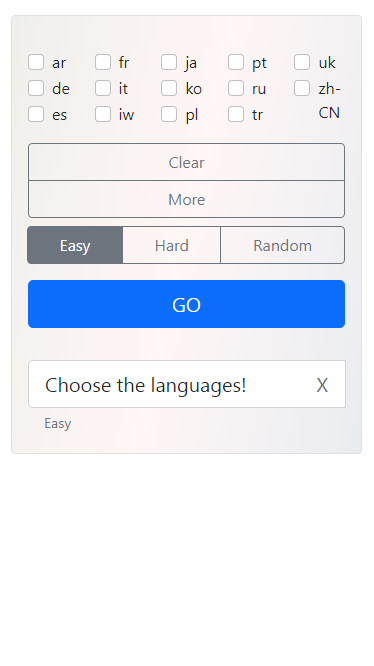
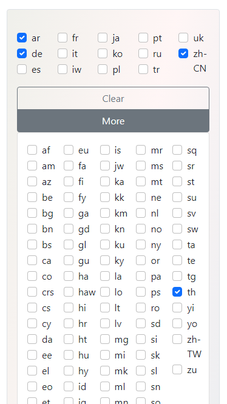
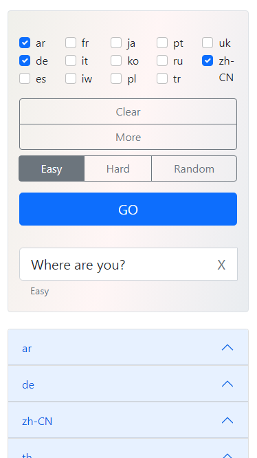
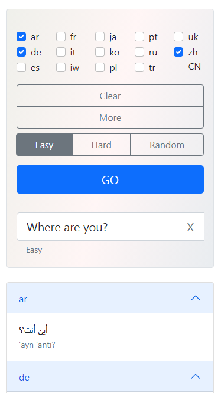
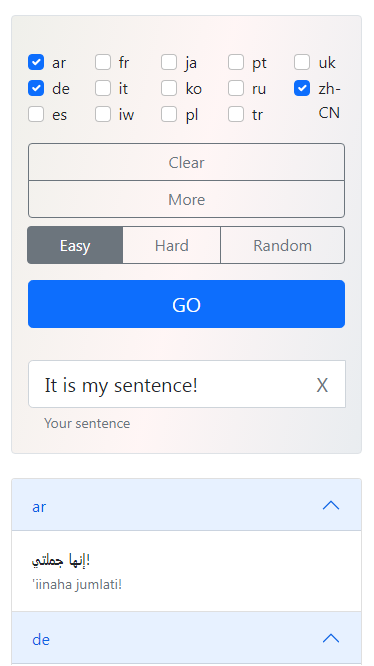

# multiple-translator
 

*2022: original git history*
 
A simple app for learning languages by translating the same sentence into multiple languages at once.
 
> Originally deployed on Heroku, back when their free tier made it easy to host small Flask apps. The listing is no longer live since Heroku discontinued free hosting.
 
## How it works
 
1. Choose the languages (up to 9)
2. Write a sentence or generate one by clicking "GO"
3. Before unfolding each translation, try to translate the sentence in your mind
4. Unfold all translations, then repeat from step 2
## Demo
 
Fully responsive — works the same on desktop and mobile.
 
| Start | More languages | Generated, folded | Unfolded | Next sentence |
|---|---|---|---|---|
|  |  |  |  |  |
 
## Tech
 
Python, Flask, some JavaScript, Bootstrap. Translations via the googletrans Google Translate Ajax API.
 
## Credits
 
- Sentence data: [GenericsKB](https://huggingface.co/datasets/generics_kb), Allen Institute for AI — CC BY 4.0. Citation: Bhakthavatsalam, S., Anastasiades, C., & Clark, P. (2020). *GenericsKB: A Knowledge Base of Generic Statements*.
- Example sentences also drawn from [englishstudyhere.com](https://englishstudyhere.com/sentences/1000-sentences-examples-in-english/), [7esl.com](https://7esl.com/english-verbs/), [englishspeak.com](https://www.englishspeak.com/en/english-phrases?category_key=20), and [onlymyenglish.com](https://onlymyenglish.com/1000-english-sentences-used-in-daily-life/).
